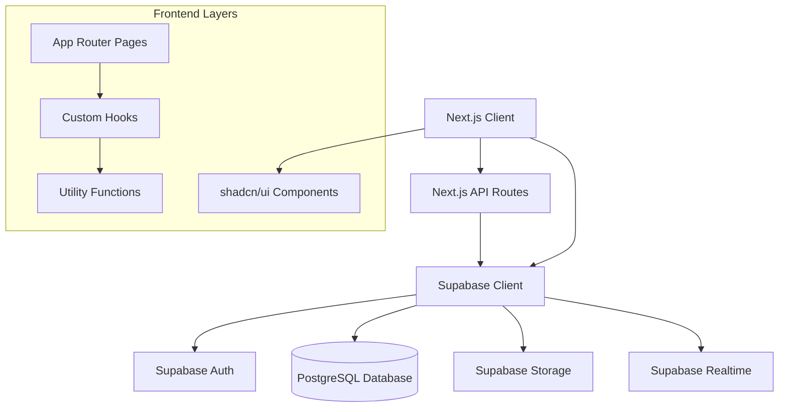

# Design Document

## Overview

SocialConnect is a full-stack social media application built with Next.js 15 (App Router), Supabase, and shadcn/ui. The architecture follows modern React patterns with server-side rendering, real-time capabilities, and a component-driven UI approach. The application implements a secure, scalable social platform with role-based access control and comprehensive content management features.

## Architecture

### High-Level Architecture



### Technology Stack

- **Frontend**: Next.js 15 with App Router, React 19, TypeScript
- **UI Library**: shadcn/ui with Tailwind CSS
- **Backend**: Next.js API Routes
- **Database**: Supabase (PostgreSQL with Row Level Security)
- **Authentication**: Supabase Auth (JWT-based)
- **File Storage**: Supabase Storage
- **Real-time**: Supabase Realtime subscriptions
- **Icons**: Lucide React

### Project Structure

```
src/
├── app/
│   ├── (auth)/
│   │   ├── login/
│   │   ├── register/
│   │   └── reset-password/
│   ├── (dashboard)/
│   │   ├── feed/
│   │   ├── profile/
│   │   ├── notifications/
│   │   └── admin/
│   ├── api/
│   │   ├── auth/
│   │   ├── users/
│   │   ├── posts/
│   │   ├── follow/
│   │   ├── notifications/
│   │   └── admin/
│   ├── globals.css
│   ├── layout.tsx
│   └── page.tsx
├── components/
│   ├── ui/ (shadcn/ui components)
│   ├── auth/
│   ├── posts/
│   ├── profile/
│   ├── notifications/
│   └── admin/
├── lib/
│   ├── supabase/
│   ├── auth/
│   ├── validations/
│   └── utils.ts
├── hooks/
├── types/
└── constants/
```

## Components and Interfaces

### Core Data Types

```typescript
// User Profile
interface Profile {
  id: string;
  username: string;
  bio?: string;
  avatar_url?: string;
  website?: string;
  location?: string;
  role: 'user' | 'admin';
  profile_visibility: 'public' | 'private' | 'followers_only';
  follower_count: number;
  following_count: number;
  post_count: number;
  created_at: string;
  updated_at: string;
}

// Post
interface Post {
  id: string;
  content: string;
  image_url?: string;
  author_id: string;
  category: 'general' | 'announcement' | 'question';
  created_at: string;
  updated_at: string;
  is_active: boolean;
  like_count: number;
  comment_count: number;
  author: Profile;
  is_liked_by_user?: boolean;
}

// Comment
interface Comment {
  id: string;
  post_id: string;
  author_id: string;
  content: string;
  is_active: boolean;
  created_at: string;
  author: Profile;
}

// Notification
interface Notification {
  id: string;
  recipient_id: string;
  sender_id: string;
  notification_type: 'follow' | 'like' | 'comment';
  post_id?: string;
  message: string;
  is_read: boolean;
  created_at: string;
  sender: Profile;
}
```

### Authentication Components

- **LoginForm**: Email/password login with validation
- **RegisterForm**: User registration with email verification
- **ResetPasswordForm**: Password reset functionality
- **AuthGuard**: HOC for protecting routes
- **RoleGuard**: HOC for admin-only routes

### Post Components

- **PostCard**: Display individual posts with interactions
- **PostForm**: Create/edit post form with image upload
- **PostFeed**: Paginated list of posts
- **PostActions**: Like, comment, delete actions
- **CommentSection**: Display and add comments

### Profile Components

- **ProfileHeader**: User info, follow button, stats
- **ProfileForm**: Edit profile form with avatar upload
- **ProfileTabs**: Posts, followers, following tabs
- **FollowButton**: Follow/unfollow functionality

### Notification Components

- **NotificationDropdown**: Real-time notification panel
- **NotificationItem**: Individual notification display
- **NotificationBadge**: Unread count indicator

### Admin Components

- **UserManagement**: List and manage users
- **PostModeration**: View and delete posts
- **AdminStats**: Platform statistics dashboard

## Data Models

### Database Schema

```sql
-- Profiles table (extends Supabase auth.users)
CREATE TABLE profiles (
  id UUID REFERENCES auth.users(id) PRIMARY KEY,
  username VARCHAR(30) UNIQUE NOT NULL,
  bio VARCHAR(160),
  avatar_url TEXT,
  website TEXT,
  location TEXT,
  role VARCHAR(10) DEFAULT 'user' CHECK (role IN ('user', 'admin')),
  profile_visibility VARCHAR(20) DEFAULT 'public' 
    CHECK (profile_visibility IN ('public', 'private', 'followers_only')),
  created_at TIMESTAMP WITH TIME ZONE DEFAULT NOW(),
  updated_at TIMESTAMP WITH TIME ZONE DEFAULT NOW()
);

-- Posts table
CREATE TABLE posts (
  id UUID DEFAULT gen_random_uuid() PRIMARY KEY,
  content VARCHAR(280) NOT NULL,
  image_url TEXT,
  author_id UUID REFERENCES profiles(id) ON DELETE CASCADE,
  category VARCHAR(20) DEFAULT 'general' 
    CHECK (category IN ('general', 'announcement', 'question')),
  created_at TIMESTAMP WITH TIME ZONE DEFAULT NOW(),
  updated_at TIMESTAMP WITH TIME ZONE DEFAULT NOW(),
  is_active BOOLEAN DEFAULT true,
  like_count INTEGER DEFAULT 0,
  comment_count INTEGER DEFAULT 0
);

-- Follows table
CREATE TABLE follows (
  follower_id UUID REFERENCES profiles(id) ON DELETE CASCADE,
  following_id UUID REFERENCES profiles(id) ON DELETE CASCADE,
  created_at TIMESTAMP WITH TIME ZONE DEFAULT NOW(),
  PRIMARY KEY (follower_id, following_id),
  CHECK (follower_id != following_id)
);

-- Comments table
CREATE TABLE comments (
  id UUID DEFAULT gen_random_uuid() PRIMARY KEY,
  post_id UUID REFERENCES posts(id) ON DELETE CASCADE,
  author_id UUID REFERENCES profiles(id) ON DELETE CASCADE,
  content VARCHAR(200) NOT NULL,
  is_active BOOLEAN DEFAULT true,
  created_at TIMESTAMP WITH TIME ZONE DEFAULT NOW()
);

-- Likes table
CREATE TABLE likes (
  user_id UUID REFERENCES profiles(id) ON DELETE CASCADE,
  post_id UUID REFERENCES posts(id) ON DELETE CASCADE,
  created_at TIMESTAMP WITH TIME ZONE DEFAULT NOW(),
  PRIMARY KEY (user_id, post_id)
);

-- Notifications table
CREATE TABLE notifications (
  id UUID DEFAULT gen_random_uuid() PRIMARY KEY,
  recipient_id UUID REFERENCES profiles(id) ON DELETE CASCADE,
  sender_id UUID REFERENCES profiles(id) ON DELETE CASCADE,
  notification_type VARCHAR(20) NOT NULL 
    CHECK (notification_type IN ('follow', 'like', 'comment')),
  post_id UUID REFERENCES posts(id) ON DELETE CASCADE,
  message TEXT NOT NULL,
  is_read BOOLEAN DEFAULT false,
  created_at TIMESTAMP WITH TIME ZONE DEFAULT NOW()
);
```

### Row Level Security Policies

```sql
-- Profiles RLS
ALTER TABLE profiles ENABLE ROW LEVEL SECURITY;

CREATE POLICY "Public profiles are viewable by everyone" ON profiles
  FOR SELECT USING (profile_visibility = 'public');

CREATE POLICY "Users can view their own profile" ON profiles
  FOR SELECT USING (auth.uid() = id);

CREATE POLICY "Users can update their own profile" ON profiles
  FOR UPDATE USING (auth.uid() = id);

-- Posts RLS
ALTER TABLE posts ENABLE ROW LEVEL SECURITY;

CREATE POLICY "Posts are viewable by everyone" ON posts
  FOR SELECT USING (is_active = true);

CREATE POLICY "Users can create their own posts" ON posts
  FOR INSERT WITH CHECK (auth.uid() = author_id);

CREATE POLICY "Users can update their own posts" ON posts
  FOR UPDATE USING (auth.uid() = author_id);

-- Similar policies for other tables...
```

## Error Handling

### API Error Response Format

```typescript
interface APIError {
  error: string;
  message: string;
  statusCode: number;
  details?: any;
}

interface APIResponse<T> {
  data?: T;
  error?: APIError;
  success: boolean;
}
```

### Error Handling Strategy

1. **Client-Side Errors**: Use shadcn/ui toast components for user feedback
2. **API Errors**: Consistent error response format with appropriate HTTP status codes
3. **Database Errors**: Supabase error handling with user-friendly messages
4. **Validation Errors**: Real-time form validation with field-specific error messages
5. **Authentication Errors**: Redirect to login with appropriate error messages

### Error Boundaries

```typescript
// Global error boundary for unhandled errors
class GlobalErrorBoundary extends React.Component {
  // Handle unexpected errors and show fallback UI
}

// Route-specific error boundaries for better UX
class RouteErrorBoundary extends React.Component {
  // Handle route-specific errors
}
```

## Testing Strategy

### Testing Pyramid

1. **Unit Tests**: Individual components and utility functions
2. **Integration Tests**: API routes and database operations
3. **End-to-End Tests**: Critical user flows

### Testing Tools and Approach

- **Jest + React Testing Library**: Component testing
- **Supertest**: API endpoint testing
- **Playwright**: E2E testing
- **MSW (Mock Service Worker)**: API mocking for tests

### Key Test Scenarios

1. **Authentication Flow**: Registration, login, logout, password reset
2. **Post Management**: Create, edit, delete posts with images
3. **Social Interactions**: Follow/unfollow, like/unlike, commenting
4. **Real-time Features**: Notification delivery and updates
5. **Admin Functions**: User management and content moderation
6. **Security**: Authorization checks and data access controls

### Performance Testing

- **Load Testing**: API endpoints under concurrent users
- **Image Upload Testing**: File size and format validation
- **Database Performance**: Query optimization and indexing
- **Real-time Performance**: WebSocket connection handling

## Security Considerations

### Authentication Security

- JWT token validation on all protected routes
- Secure token storage (httpOnly cookies for sensitive operations)
- Token refresh mechanism for long-lived sessions
- Rate limiting on authentication endpoints

### Data Security

- Row Level Security (RLS) policies in Supabase
- Input validation and sanitization
- SQL injection prevention through parameterized queries
- XSS protection through proper data encoding

### File Upload Security

- File type validation (JPEG/PNG only)
- File size limits (2MB maximum)
- Virus scanning for uploaded files
- Secure file storage with access controls

### API Security

- CORS configuration for allowed origins
- Request rate limiting
- Input validation middleware
- Error message sanitization (no sensitive data exposure)

## Performance Optimization

### Frontend Performance

- **Code Splitting**: Route-based and component-based splitting
- **Image Optimization**: Next.js Image component with lazy loading
- **Caching**: Browser caching for static assets
- **Bundle Optimization**: Tree shaking and minification

### Backend Performance

- **Database Indexing**: Optimized indexes for common queries
- **Query Optimization**: Efficient joins and pagination
- **Caching Strategy**: Redis for frequently accessed data
- **Connection Pooling**: Supabase connection management

### Real-time Performance

- **Selective Subscriptions**: Only subscribe to relevant data changes
- **Debouncing**: Prevent excessive real-time updates
- **Connection Management**: Proper cleanup of WebSocket connections

## Deployment and Infrastructure

### Environment Configuration

- **Development**: Local Supabase instance
- **Staging**: Supabase staging project
- **Production**: Supabase production project with backups

### Environment Variables

```env
NEXT_PUBLIC_SUPABASE_URL=
NEXT_PUBLIC_SUPABASE_ANON_KEY=
SUPABASE_SERVICE_ROLE_KEY=
NEXTAUTH_SECRET=
NEXTAUTH_URL=
```

### Deployment Strategy

- **Vercel Deployment**: Automatic deployments from Git
- **Database Migrations**: Supabase migration system
- **Asset Management**: Supabase Storage for user uploads
- **Monitoring**: Error tracking and performance monitoring